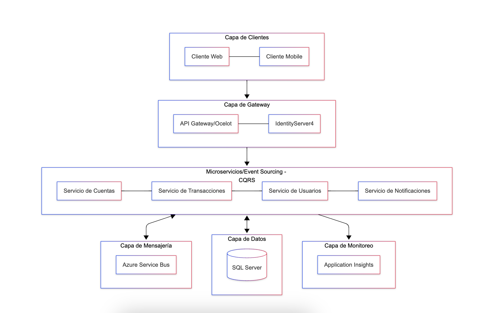

# Enunciado: Diseño de Arquitectura Distribuida para Sistema Financiero

## Objetivo
Diseñar una arquitectura distribuida para un sistema de gestión de transacciones financieras utilizando .NET Core.

# Solucion

## Diagrama de Arquitectura

## Explicación

### Autenticación
Para la autenticación se utiliza IdentityServer4 para manejar los tokens y el login de usuarios.

### Autorización
Para la autorización se utiliza ASP.NET Core Identity para manejar los roles y permisos de los usuarios.

### Arquitectura
Las arquitecturas de los microservicios están basadas en Event Sourcing y CQRS (Command Query Responsibility Segregation). De esta manera se tiene:
- Event Sourcing: Mantiene un registro inmutable de todos los eventos de negocio
- CQRS: Separa las operaciones de lectura (queries) y escritura (commands) para optimizar el rendimiento y escalabilidad

### Capa de Gateway
El API Gateway (implementado con Ocelot) actúa como punto de entrada único para todos los clientes, proporcionando:
- Enrutamiento de solicitudes
- Agregación de APIs
- Control de acceso y seguridad

### Capa de Mensajería
Se utiliza Azure Service Bus como sistema de mensajería para:
- Comunicación asíncrona entre microservicios
- Implementación del patrón de eventos
- Garantizar la entrega de mensajes

### Logging y Monitoring
Para el logging y monitoring se utiliza Azure Application Insights para:
- Monitoreo de rendimiento
- Trazabilidad distribuida
- Análisis de métricas y telemetría
- Detección y diagnóstico de problemas

### Escalabilidad
La arquitectura permite escalar horizontalmente mediante:
- Azure App Service para el balanceo de carga
- Kubernetes para la orquestación de contenedores y autoescalado
- Despliegue independiente de cada microservicio

